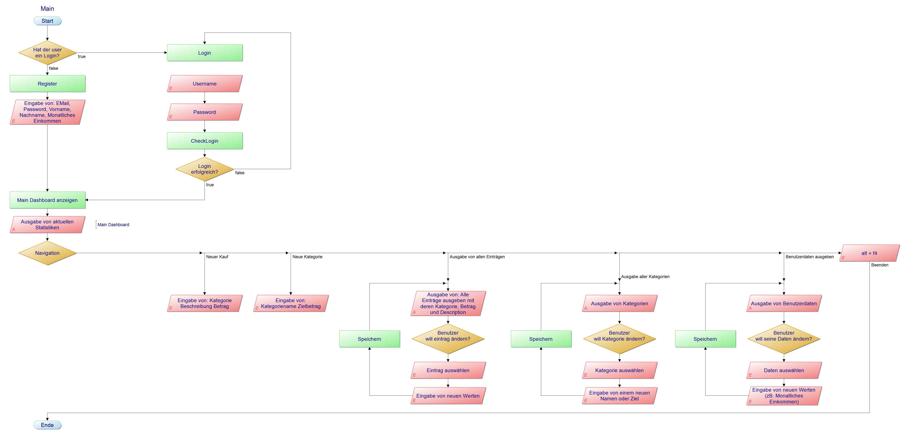
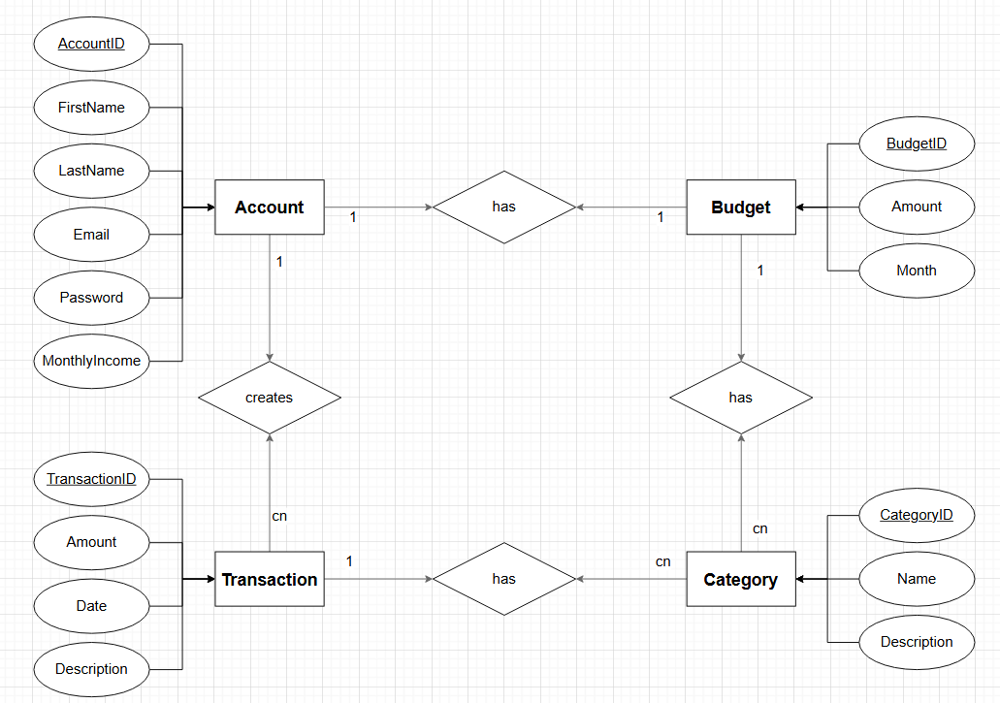
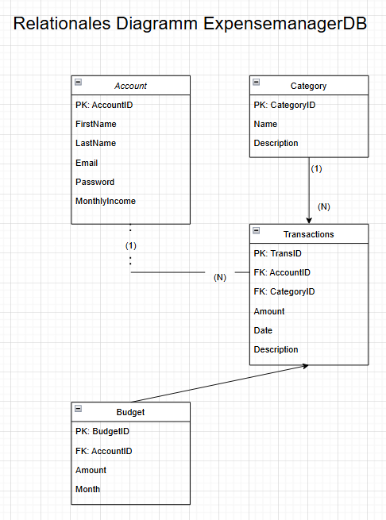

# Dokumentation IPT-6.1_Expensemanager
## UML Klassendiagramm
verlinkung und Auszüge

## Verlinkung zum Video
verlinkung und Auszüge
## Arbeitsjournal
Link zum [Arbeitsjournal](https://gitlab.com/LuisAll12/ipt-6.1_expensemanager/-/blob/main/Dokumentation/Projektplanung&Arbeits%C3%BCbersicht/Arbeitsjournal.xlsx?ref_type=heads)
Screenshot vom finalen Arbeitsjournal
## Programmablauplan
Link zum [Programmablaufplan](https://gitlab.com/LuisAll12/ipt-6.1_expensemanager/-/blob/main/Dokumentation/Anwendung-Dokumentation/Ablaufdiagramm.pap?ref_type=heads)

## Ziel und Funktionale Features
Link zu den [Funktionalen Features](https://gitlab.com/LuisAll12/ipt-6.1_expensemanager/-/blob/main/Dokumentation/Anwendung-Dokumentation/Projektbeschreibung-Ziel&Funktinalit%C3%A4t.md?ref_type=heads)
## ER-Modell von Datenbank
Link zum [ER-Modell](https://gitlab.com/LuisAll12/ipt-6.1_expensemanager/-/blob/main/Dokumentation/Datenbank-Diagramme/ER-Diagramm.drawio.bkp?ref_type=heads)

## Relationales-Modell von Datenbank
Link zum [Relationales-Modell](https://gitlab.com/LuisAll12/ipt-6.1_expensemanager/-/blob/main/Dokumentation/Datenbank-Diagramme/Relationen-Diagramm.drawio?ref_type=heads)

## Mockup
Link zum [Mockup](https://gitlab.com/LuisAll12/ipt-6.1_expensemanager/-/blob/main/Dokumentation/Mockup/Mockup.pptx?ref_type=heads)
## Projektplanung
Link zum [Arbeitsjournal](https://gitlab.com/LuisAll12/ipt-6.1_expensemanager/-/blob/main/Dokumentation/Projektplanung&Arbeits%C3%BCbersicht/Arbeitsjournal.xlsx?ref_type=heads)
(Planung im Arbeitsjournal vorhanden, wurde jeweils für die nächste Woche geplant)
## SQL-Scripts
Link zu den SQL-Scripts: [Create](), [Update](), [Insert]()
 

---
zurück zum [Readme..](https://gitlab.com/LuisAll12/ipt-6.1_expensemanager/-/tree/main)

